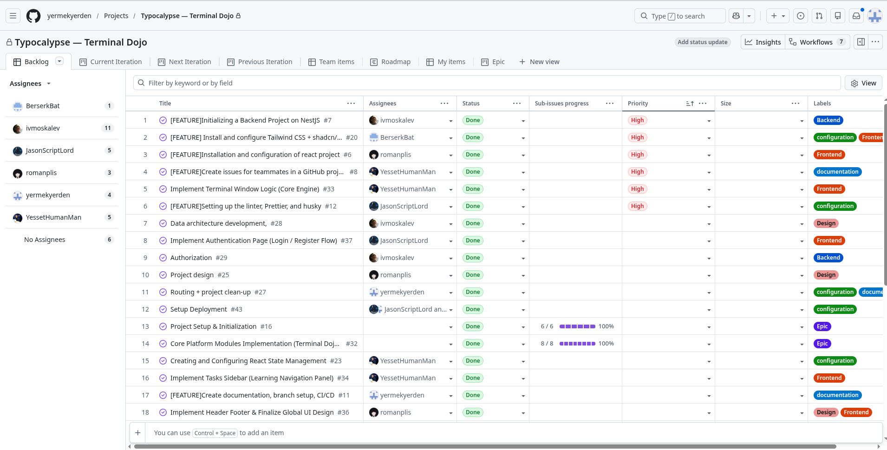

# Typocalypse — Terminal Dojo 🧠💻

Welcome to **Typocalypse — Terminal Dojo**, a game-like CLI training app built for **RS School Tandem**.

This project helps users practice real Linux terminal thinking in a **safe simulated sandbox**.
No dangerous OS execution. No accidental `rm -rf /`. No drama. Just missions, feedback, and steady command-line progress. 😌🐧

---

## About the Project 🎯

**Terminal Dojo** is a mission-based learning app where users train CLI habits through structured lessons and executable missions.

Instead of typing commands into a real shell, users interact with a **controlled simulated terminal environment**.
The app validates results, explains what failed and why, and helps learners build real command-line intuition in a deterministic and safe way.

### Demo Video 🎬

- **Week 5 Checkpoint Demo:** https://youtu.be/uKDvLehNQkE

### What We’re Proud Of 🌟

We are proud that the project is built around a **safe simulated shell**, not around risky real command execution.
The team created a product that combines **frontend, backend, documentation, and learning content** into one coherent system.
We also built a structure that is easier to explain, review, and extend: routes, API, execution flow, learning modules, and docs are connected clearly.
A strong side of the project is the balance between **technical architecture** and **learning UX**.
We tried to make the app realistic enough to teach real CLI habits, while still keeping it deterministic, reviewable, and safe for learners.

---

## Team 👥

> Course-required format: **Name + GitHub link**.
> We also include diary links for easier review.

- **TL: Yermek Yerdenov**
  GitHub: https://github.com/yermekyerden
  Diary: https://github.com/yermekyerden/typocalypse-tandem/tree/main/development-notes/yermekyerden

- **Denis Nasonov**
  GitHub: https://github.com/JasonScriptLord
  Diary: https://github.com/yermekyerden/typocalypse-tandem/tree/main/development-notes/JasonScriptLord

- **Yesset Bimanov**
  GitHub: https://github.com/YessetHumanMan
  Diary: https://github.com/yermekyerden/typocalypse-tandem/tree/main/development-notes/YessetHumanMan

- **Alessya Tkachenko**
  GitHub: https://github.com/BerserkBat
  Diary: https://github.com/yermekyerden/typocalypse-tandem/tree/main/development-notes/BerserkBat

- **Roman Plis**
  GitHub: https://github.com/romanplis
  Diary: https://github.com/yermekyerden/typocalypse-tandem/tree/main/development-notes/romanplis

- **Mentor: Igor Moskalev**
  GitHub: https://github.com/ivmoskalev

---

## What We’re Building 🛠️

A mission-based “terminal dojo” where users type commands in a controlled environment, solve practical tasks, and gradually unlock progress.

The app checks results through **state/output validation**, explains mistakes, and encourages learners to think like terminal users instead of memorizing commands blindly.

---

## MVP Scope ✅

- 🖥️ Terminal-like UI + input experience
- 🧩 Safe command subset (simulated, no OS execution)
- 🗂️ Virtual File System (VFS) for deterministic missions
- 🧪 Mission runner + validators (state/output checks)
- 💡 Clear failure feedback (“what failed and why”)
- 📈 Progress tracking and lesson-based learning flow

---

## Current Project Status 🚧

The repository already contains:

- **Frontend** web client
- **Backend** NestJS API
- **Project docs** with SSOT-oriented structure
- **Development diary** artifacts required by the course
- **Meeting notes**
- **Frontend CI**
- **GitHub Pages deploy**
- **AI assistant integration**
- **Learning content, lesson flow, and mission execution logic**

Current frontend routing includes screens for:

- library
- mission run
- replay
- profile
- authentication
- not found

So yes, the dojo already has walls, doors, scrolls, and a slightly overachieving assistant. 🧙‍♂️💬

---

## Board 📋

- **Board link:** https://github.com/users/yermekyerden/projects/3/views/1



---

## Best PRs ⭐

Below are some of the most meaningful PRs in the project.
We selected them because they include either substantial implementation scope, substantial review / follow-up discussion, or both.

### 1. PR #82 — OpenRouter-backed attempt hint endpoint
https://github.com/yermekyerden/typocalypse-tandem/pull/82

A strong backend vertical slice for the AI assistant:
- dedicated `AssistantModule`
- authenticated attempt-based endpoint
- OpenRouter integration behind the backend layer
- contextual hint generation based on learner progress
- assistant-related tests added and improved after review

This PR is also one of the best examples of meaningful technical review in the repository: it includes must-fix feedback on request timeout handling, service flow correctness, environment handling, lesson-attempt edge cases, and test coverage, followed by concrete fixes and re-review before approval.

### 2. PR #41 — Module mocks and lesson selection sidebar
https://github.com/yermekyerden/typocalypse-tandem/pull/41

A meaningful frontend PR that moved the learning UI forward:
- mocked learning modules and lesson content
- lesson selection state
- modules sidebar
- synchronized `LibraryScreen` behavior

This PR stands out because the review was not superficial: it included feedback on type safety, state updates during render, semantics and accessibility, build correctness, and active-state logic. It is a good example of practical frontend review improving both code quality and UI behavior.

### 3. PR #95 — Lesson-centric API contracts and lesson-mission mapping
https://github.com/yermekyerden/typocalypse-tandem/pull/95

An important backend/contracts PR that helped shape the lesson-based learning flow:
- updated lesson-centric API contracts
- added lesson-to-mission mapping as a source of truth
- added startup validation for mapping correctness
- introduced a new mission aligned with the lesson flow

This PR is important because it affected the data foundation of the learning system, not just one isolated feature. It also had technical follow-up discussion around integration issues and environment consistency during backend verification.

### 4. PR #107 — End-to-end contextual streaming assistant for library tasks
https://github.com/yermekyerden/typocalypse-tandem/pull/107

One of the biggest product-level PRs in the repository:
- frontend + backend assistant integration
- streaming responses
- transcript hydration
- retry / stop flows
- localized assistant behavior
- per-attempt history
- dev-only mock mode for QA

This PR is included because it represents one of the strongest end-to-end feature slices in the project and shows how multiple layers of the system were connected into one coherent user-facing feature.

## Tech Stack 🛠️

### Frontend 🎨

- ⚛️ React + TypeScript (**strict**)
- ⚡ Vite
- 🌬️ Tailwind CSS v4
- 🧱 shadcn/ui
- 🗺️ React Router
- 🧠 Zustand

### Backend 🧰

- 🪺 NestJS
- 📘 Swagger / OpenAPI
- ✅ ValidationPipe
- 🩺 Health checks

### Tooling 🔧

- 🐶 Husky
- 🧹 ESLint
- 🎯 Prettier
- 🧪 Vitest (frontend)
- 🤖 GitHub Actions

---

## Limitations (by Design) 🧱

- 🐚 This is **not** a full Bash implementation
- 🔒 No arbitrary code execution, no real OS command execution
- 📜 Only documented and supported commands/features are part of the learning flow
- 🧭 The product is intentionally deterministic and educational, not a full Linux emulator

In short: this is a dojo, not a full operating system with anger issues. 😄

---

## Repository Structure 🗂️

```text
.
├── frontend/            # React + TypeScript web client
├── backend/             # NestJS API
├── docs/                # SSOT docs: product, architecture, process
├── development-notes/   # Course diary artifacts
├── meeting-notes/       # Key points and tasks discussed in meetings
└── .github/workflows/   # CI and Pages deploy
````

---

## Useful Links 🔗

* 🚀 **Live demo** (GitHub Pages, deployed from `main`):
  [https://yermekyerden.github.io/typocalypse-tandem/](https://yermekyerden.github.io/typocalypse-tandem/)

* 📚 **Docs hub:**
  `docs/README.md`

* ⚡ **Quick Summary:**
  `docs/00-quick-summary/README.md`

* 🎯 **Vision:**
  `docs/00-overview/vision.md`

* 🏗️ **Architecture:**
  `docs/02-architecture/system-overview.md`

* 📄 **Contracts:**
  `docs/02-architecture/data-contracts.md`

* 🎨 **Design (Figma):**
  [https://www.figma.com/design/M8k8QQWPYbfbfTUdQdFSye/Terminal-Dojo?node-id=0-1&t=LA99qExkew468f47-1](https://www.figma.com/design/M8k8QQWPYbfbfTUdQdFSye/Terminal-Dojo?node-id=0-1&t=LA99qExkew468f47-1)

* 🎬 **Week 5 Checkpoint Video:**
  [https://youtu.be/uKDvLehNQkE](https://youtu.be/uKDvLehNQkE)

---

## Meeting Notes 🗓️

* February 4, 2026 — [https://github.com/yermekyerden/typocalypse-tandem/tree/main/meeting-notes/2026-02-04](https://github.com/yermekyerden/typocalypse-tandem/tree/main/meeting-notes/2026-02-04)
* February 11, 2026 — [https://github.com/yermekyerden/typocalypse-tandem/tree/main/meeting-notes/2026-02-11](https://github.com/yermekyerden/typocalypse-tandem/tree/main/meeting-notes/2026-02-11)
* February 22, 2026 — [https://github.com/yermekyerden/typocalypse-tandem/tree/main/meeting-notes/2026-02-22](https://github.com/yermekyerden/typocalypse-tandem/tree/main/meeting-notes/2026-02-22)
* February 25, 2026 — [https://github.com/yermekyerden/typocalypse-tandem/tree/main/meeting-notes/2026-02-25](https://github.com/yermekyerden/typocalypse-tandem/tree/main/meeting-notes/2026-02-25)
* March 18, 2026 — [https://github.com/yermekyerden/typocalypse-tandem/tree/main/meeting-notes/2026-03-18](https://github.com/yermekyerden/typocalypse-tandem/tree/main/meeting-notes/2026-03-18)

---

## Requirements 📦

* Node.js **22** (see `.nvmrc`)

---

## How to Run Locally 🚀

### Frontend

```bash
nvm use
cd frontend
npm ci
npm run dev
```

Then open the local Vite URL shown in the terminal.

### Backend

```bash
nvm use
cd backend
npm ci
npm run start:dev
```

Backend default URL:

```text
http://localhost:3001
```

---

## Quality Checks ✅

### Frontend

```bash
cd frontend
npm run lint
npm run format:check
npm run build
npm run test
```

### Backend

```bash
cd backend
npm run lint
npm run format:check
npm run build
npm run test
npm run test:e2e
```

---

## Repository Workflow 🧭

* 🌿 `main` — stable branch, release/checkpoint snapshots, GitHub Pages deploy
* 🧪 `develop` — integration branch for daily team work
* 🧵 feature branches — `feat/*`, `fix/*`, `docs/*`, `chore/*` → PR → merge into `develop`
* 📝 documentation / diary updates — handled through focused branches and PRs when needed

---

## Docs-First Rule 📚

If something feels unclear in the codebase, the first question is:

**What do the docs say?**

Start here:

* `docs/README.md`
* `docs/00-quick-summary/README.md`

Because sometimes the fastest way to understand a system is not to guess — it is to read the map before walking into the dungeon. 🗺️

---

## Notes 📝

* Live demo is deployed from **`main`**, so it may lag behind the latest changes in `develop`.
* The project is intentionally built around a **safe simulated shell**, not around real OS command execution.
* Some functionality is still evolving, but the repository already reflects a real integrated learning product with frontend, backend, content, and docs.
