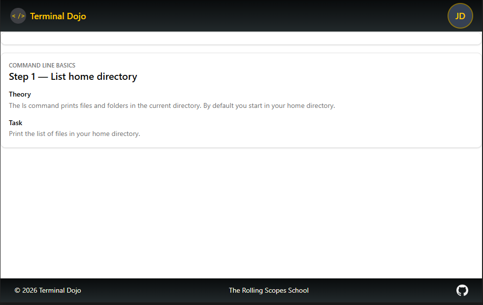

# Date: 2026-03-03

## Что было сделано

- Сделаны header и footer, каждый как отдельный компонент.

- Создана отдельная папка для иконок.

- 

## Проблемы

- Было непонятно как импортировать иконки.

## Решения (или попытки)

- Класть иконки в отдельную папку и импортировать кладя в переменную.

## Мысли / Планы

- Изолируй компоненты - разделяй и властвуй.

## Затраченное время

- 4 часа.
