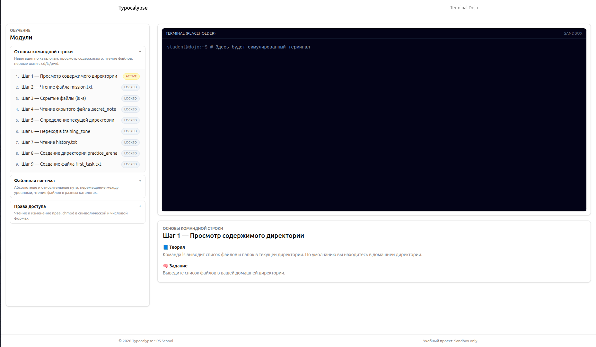

# Date: 2026-03-01

## Что было сделано
За эти дни подключил zustand к первому реальному модулю: экран миссий. Вынес стор в отдельный слой и добавил первые селекторы для прогресса пользователя.

## Контекст / Примечания
- Работаю в своей фича ветке, делаю камиты и создаю PR.  
- Чувствуется, что после стартовой суматохи появился ритм: задачи двигаются, PR-ы летят, доска перестала стоять.

## Решение
### Разработал базовый контент  (модуль) для учебного терминала.
  #### Основы командной строки
   - Просмотр содержимого директории
   - Чтение файла
   - Скрытые файлы
   - Чтение скрытого файла
   - Определение текущей директории
   - Переход в новую директорию
   - Работа внутри новой директории
   - Создание новой директории
   - Создание файла в терминале
  
  #### Файловая система
   - Абсолютный путь
   - Работа внутри каталога
   - Переход с использованием относительного пути
   - Переход на уровень выше
   - Переход через несколько уровней
   - Работа с архивом

  #### Права доступа
   - Определение владельца файла
   - Попытка чтения файла
   - Изменение прав доступа
   - Проверка изменений
   - Повторное чтение файла

 ### Разработал нижний блок отоброжения задания для выполнения

## План действия
- Доделать загрузку миссий из API, как только бэкенд отдаст первый ендпоинт.  
- Привести стор к единому соглашению по неймингу действий (camelCase).  
- После мерджа — написать короткую заметку в README фронта про структуру папок.

## Итоги
Стор на месте, первые компоненты читают состояние через zustand, есть понятный скелет под дальнейшие фичи. Контент готов для дальнейшего развития прроекта.

## Дальнейший план
- Забрать данные с реального API и убрать моки.
- Продолжать ревью бэкенд PR-ов, чтобы согласовать контракты frontend + backend.  
- Следить за доской: закрыть эпик спринта к середине недели.
