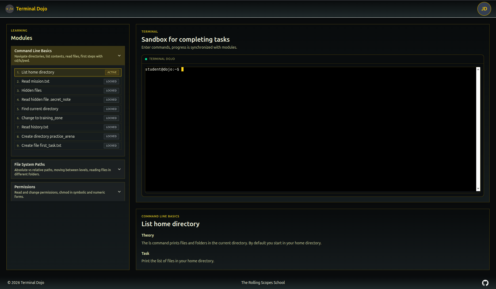
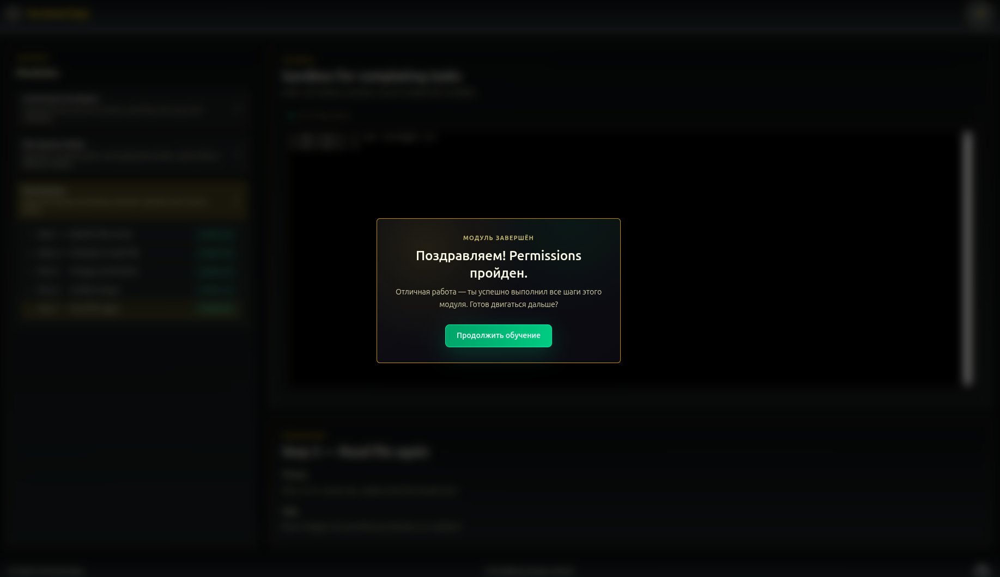

# Date: 2026-03-06

## Что было сделано
- Подключил реальный терминал на xterm.js: рендерит подсвеченный вывод, поддерживает историю, Ctrl+C, автофит в контейнер и обновление промпта по cwd.
- Связал терминал с учебным прогрессом: при завершении модуля экран очищается и история команд сбрасывается перед следующим модулем.
- UI-полировка: убрал подчеркивание при наведении в сайдбаре модулей; привел модальное окно завершения модуля к тёмно-янтарной теме с более выразительной кнопкой.

## Контекст / Примечания
- Работа велась в ветке `feat/front-implement-xterm`.
- Добавлены зависимости `xterm` и `xterm-addon-fit`; npm предупреждает о переходе на `@xterm/*` — можно сделать отдельной задачей.

## Итоги
- Терминал теперь выглядит и ведёт себя как настоящий, синхронизирован с прогрессом уроков.
- Интерфейс обучения стал чище и визуально ближе к целевому стилю.
- Сборка проходит без ошибок TypeScript.

## Дальнейшие шаги
- Перейти на пакеты `@xterm/*`, чтобы убрать предупреждения.
- Подумать о сохранении/реплее сессий терминала для рефлекса студентов.
- Доработать UX завершения курса: добавить CTA на следующий модуль или обзор прогресса.
- Добавит еще модули и контент для обучения.
- Думаю в перспиктиве предложить команде изменить дизай на Retro-80.
- Передать данные для backend для разработки состояния completed steps
