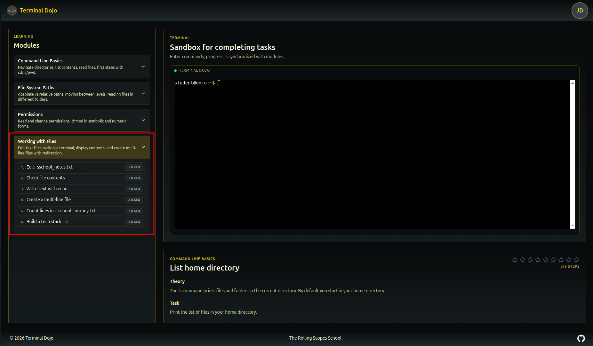
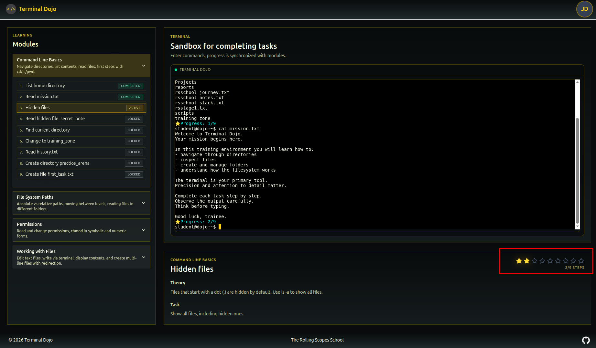

# Date: 2026-03-08

## Что было сделано
- Добавил новый модуль 4 обучающий `Working with Files`
- Реализовал поддержку команды `echo` в учебном терминале, включая вывод текста в консоль, перезапись файла и добавление текста в конец файла через виртуальную файловую систему.
- Добавил визуальный прогресс по модулю через звезды: количество звезд зависит от числа шагов, они открываются по мере выполнения уроков и отображаются в карточке текущего модуля и в окне завершения.
- Усилил логику прохождения: пользователь больше не может завершить модуль, просто активировав последний шаг; модальное окно поздравления показывается только после завершения всех уроков модуля.

## Контекст / Примечания
- Работа велась над учебным сценарием для модуля 4 и UX прогресса внутри `Terminal Dojo`.
- Обновлен мок-контент модуля и виртуальная файловая структура, чтобы новые задания можно было выполнять прямо в терминальной песочнице.
- По ходу задачи были устранены связанные проблемы: падение `runCommand`, ошибки линтера и некорректное поведение терминала при обработке новых команд.

## Итоги
- В проекте появился полноценный четвертый модуль по работе с файлами.
- Терминал поддерживает команды, необходимые для прохождения нового сценария обучения.
- Прогресс обучения стал нагляднее: выполнение шагов теперь визуально отражается через систему звезд и системные сообщения в терминале.
- Защита от преждевременного завершения модуля делает механику прохождения последовательной и предсказуемой.

## Артефакты

## Дальнейшие шаги
- Подумать над улутшением дизайна или ее изменением.
- Расширить визуальную систему достижений на весь курс, включая общий прогресс по модулям.
- Подготовить следующий учебный модуль с более сложными сценариями работы в терминале.
